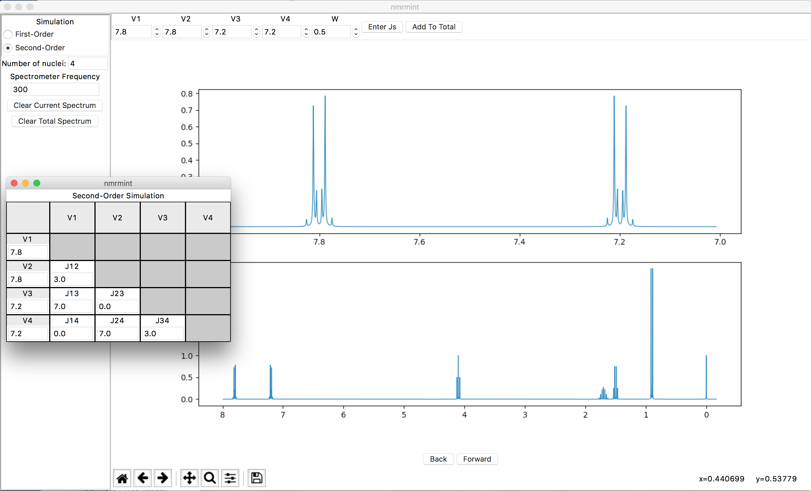

nmrmint (version 0.2 alpha)
*******************************

**nmrmint** is currently wafer-thin, and may cause indigestion.

**nmrmint**'s purpose is to simulate complete NMR spectra for use in chemical education. The application will 'mint' an NMR spectrum from user-provided chemical shifts and coupling constants.

I strongly believe that using actual experimental data for classes and exams
is to be preferred. However, sometimes it can be hard to find spectra of
sufficient quality for printing on exams. Or, you may have a spectrum that
would be easily solved at higher field strength, but you can only find
spectra taken in lower fields where second-order effects make analysis more
difficult. In such cases, nmrmint will provide you with that spectrum you need for
tomorrow's quiz.

**Version 0.2 (alpha)** provides an app with bare-bones functionality. The user can select either first-order simulation of a single nuclei, or second-order simulation of a 2-8 nuclei spin system, and add these simulated signals to a total spectrum. There are forward and backward buttons that allow the user to correct mistakes without restarting the process. Using the save icon on the plot's toolbar allows the user to save both figures (top and bottom) together as a .png.

Known issues, and desirable features, include:

* setting the spectral width
* proper implementation of peak width: the ability to control the peak width of individual signals (e.g. include a broad singlet for a hydroxyl proton).
* the ability to export the total spectrum as a PDF or .png suitable for use in a quiz, exam, powerpoint slides, etc.
* the ability to change the spectrometer frequency in the middle of creating a simulation (currently, coupling constants don't stay 'constant' in the total spectrum if the spectrometer frequency is changed)

and in the longer term:

* integration
* peak picking
* expansions

Installation and Use
====================

The project is alpha and subject to change. The master branch should
maintain a functional program. If you're curious, and have a Python 3
installation, you can download the project folders, install the requirements in requirements.txt if necessary, and run main.py from the command line.

TODO
====

See CHANGELOG.rst for the map towards a version 1.0.

Feedback
========

I welcome feedback on this project. Feel free to leave an issue on Github, or
contact me by email (mylastname at udel dot edu).

Acknowledgements
================

This project is inspired by Hans Reich's WINDNMR application. **nmrmint**
initializes its simulations with the same variables as WINDNMR's defaults,
to verify that the simulation is performing correctly.