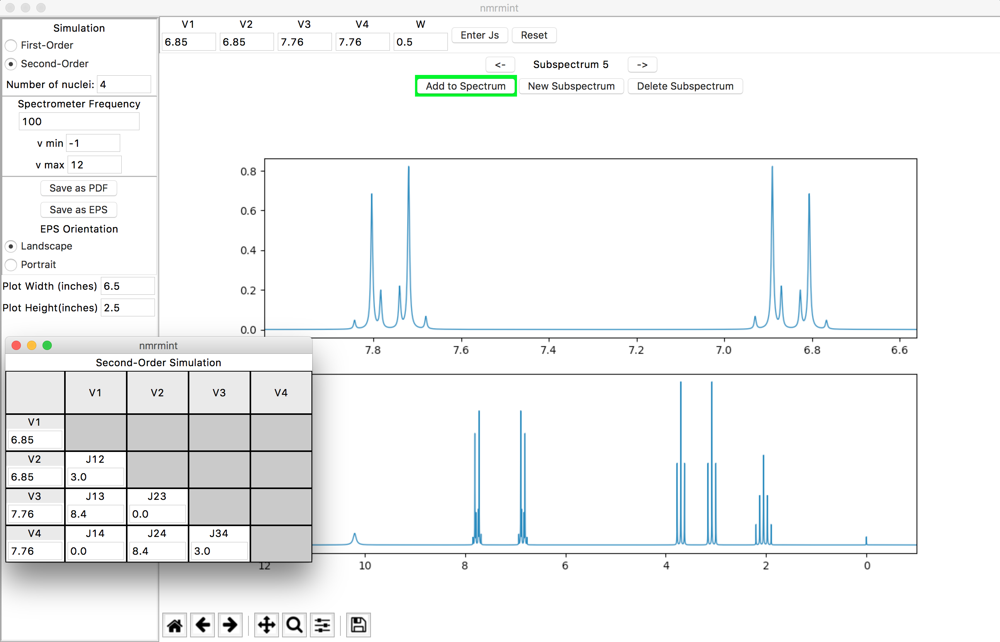

Introduction to nmrmint v0.3.1 (beta)
======================================

**nmrmint** is an application for creating simulated, complete NMR spectra
for use in chemical education. Currently, the application is limited to \ :sup:`1`\ H NMR only, but expanding this to other nuclei such as \ :sup:`13`\ C is feasible.

The total spectrum is 'minted' from a series of subspectrum simulations for individual signals or groups of signals. These subspectra are added to the total spectrum, and the resulting spectrum can be exported as a PDF or EPS file.

Individual first-order signals can be simulated, as well as second-order systems of up to 8 nuclei. Currently the simulation is capped at 8 nuclei for performance reasons. If further optimization of the quantum-mechanical calculations is realized, this limit may be extended in the future.

Individual subspectra can have custom linewidth settings. This allows the simulation of broadened signals such as for OH/NH protons undergoing exchange.

The frequency of the spectometer in MHz can also be adjusted. Simulating a 100 MHz spectrometer results in a horizontal scale of 1 ppm = 100 Hz.
