Tutorial: 1H NMR Simulation of Tyrosine
=======================================

We'll walk through the features of nmrmint by simulating a spectrum for tyrosine. First, you need to know, or have estimates for, the chemical shifts and coupling constants for the system of interest. In this case, we have the following first-order data reported for tyrosine in D\ :sub:`2`\ O:

1H NMR (500 MHz, Deuterium Oxide) δ 7.18 (d, J = 8.5 Hz, 1H), 6.89 (d, J = 8.5 Hz, 1H), 3.93 (dd, J = 7.7, 5.1 Hz, 1H), 3.19 (dd, J = 14.7, 5.1 Hz, 1H), 3.05 (dd, J = 14.7, 7.8 Hz, 1H).

Even if you had access to the original spectral data, it may not have been suitable for your purpose. In this specific case:

* The spectrum was taken in D\ :sub:`2`\ O, and there is no signal for the exchanged phenol or ammonium protons. For an exam problem, you might want these signals to be present.
* The spectrum exhibits second-order behavior, but is taken at such a high field strength (500 MHz) that this behavior is minimal. You may want to demonstrate the ABX pattern for the aliphatic protons, and the AA'XX' pattern for the phenyl protons.

First, we will simulate a first-order spectrum for tyrosine in H\ :sub:`2`\ O, and then we will create a second-order simulation at lower field strength.

First-Order Simulation
----------------------

When you run nmrmint, the default toolbar at the top of the screen is for first-order simulation of a multiplet. The fields are:

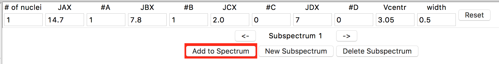

* **# of nuclei:** The number of nuclei giving rise to the signal (i.e. the integration for the signal)
* **JAX, JBX, JCX, JDX:** The coupling constants between the current nuclei being simulated ('X') and groups of neigboring nuclei (A/B/C/D). Barring exotic systems with lots of long-range coupling, no more than four different types of coupled protons are expected, so nmrmint caps the number of groups at 4.
* **#A/B/C/D:** The number of neighboring A protons that X is coupled to by coupling constant *J*\ :sub:`AX`\ .
* **Vcentr:** The frequency of the center of the multiplet, in ppm.
* **width:** The linewidth at half-height, in Hz.

Let's start with the signal furthest upfield. Enter the following in the first-order simulation toolbar:

* **# of nuclei:** 1
* **JAX:** 14.7
* **#A:** 1
* **JBX:** 7.8
* **#B:** 1
* **Vcentr:** 3.05

Check that ""#C" and ""#D" are 0, and leave width as 0.5. Note that you must commit a change in an entry (by hitting the Return/Enter or Tab keys, or by clicking on a different entry) in order for a change to take effect. You should see the following subspectrum simulation as the top plot:

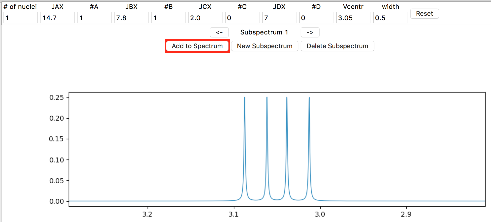

nmrmint selects an appropriate expansion for the subspectrum plot for you.

The bottom plot is the total spectrum simulation. Currently there is only a simulated TMS peak, integrating to 0.05 H. To add the subspectrum to the total spectrum, click on the Add to Spectrum button, which acts as a toggle (a red button background indicates the subspectrum is not added to the total spectrum, and a green background indicates that it is.) Go ahead and toggle it a few times, and then leave it in the green 'added' state.

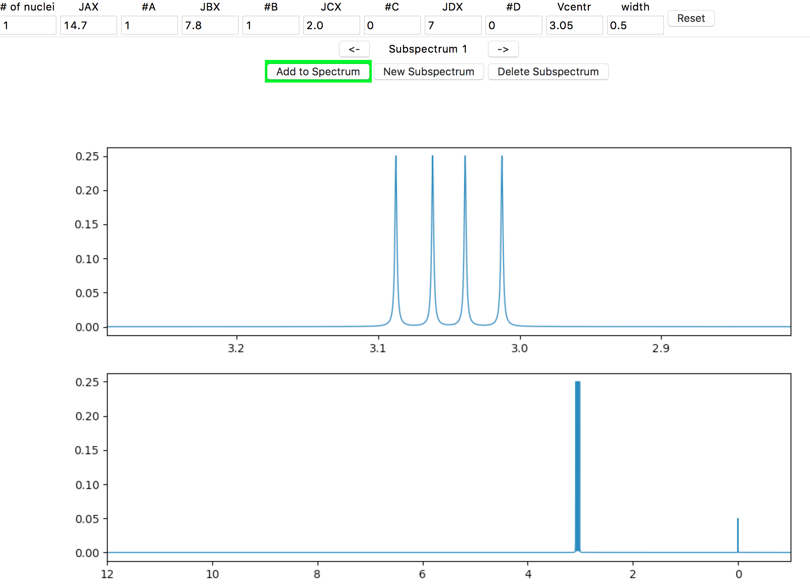

At your screen resolution, the detail of the signal splitting is probably lost. If the spectrometer is set to a lower frequency, the splitting would be more obvious. In the Spectrometer Frequency entry in the left side panel, enter "60" (MHz) and hit the Return/Enter key.

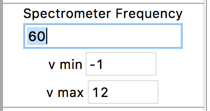

The result should look similar to this:

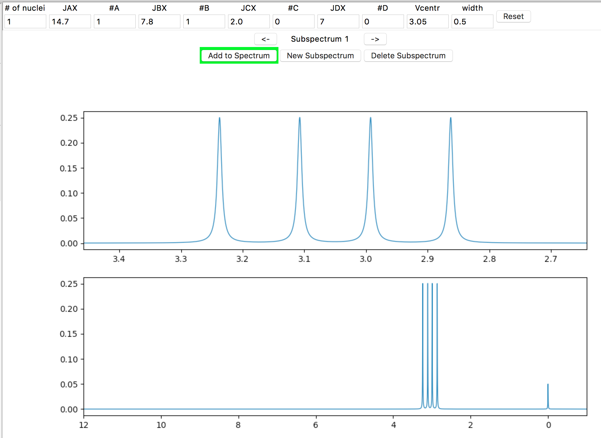

However, let's assume that you want to simulate at the same frequency as given in the source data (500 MHz). Enter "500" in the Spectrometer Frequency window and hit Return/Enter. Now, if you want to zoom in on the region of interest, adjust the minimum and maximum ppm frequencies in the "v min" and "v max" fields, which are just below the "Spectrometer Frequency" entry. For example, if you set the window with "v min" = 2.5 (ppm) and "v max" = 3.5 (ppm):

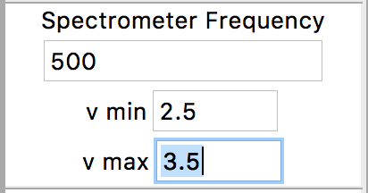

the result should look similar to this:

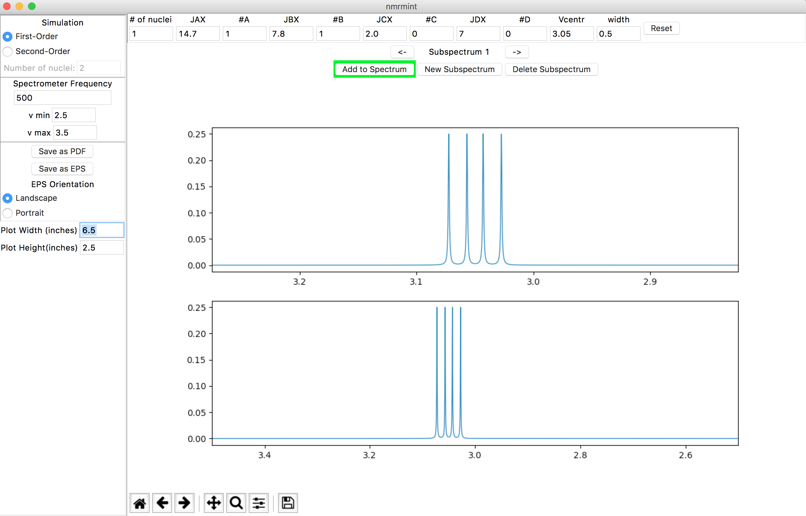

This is the recommended way to expand a region of interest. [#]_

Let's add the next signal. First, create a new subspectrum by clicking the "New Subspectrum" button in the subspectrum navigation panel:

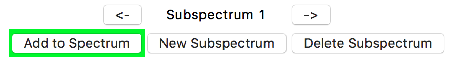

The toolbar is refreshed with its default settings, and the current subspectrum plot is refreshed as well. Enter the parameters for the next signal:

* **# of nuclei:** 1
* **JAX:** 14.7
* **#A:** 1
* **JBX:** 5.1
* **#B:** 1
* **Vcentr:** 3.19

(remember to commit all changes made, e.g. by hitting Return/Enter) and then click the "Add to Spectrum" button. Your subspectrum and total spectrum should look similar to this:

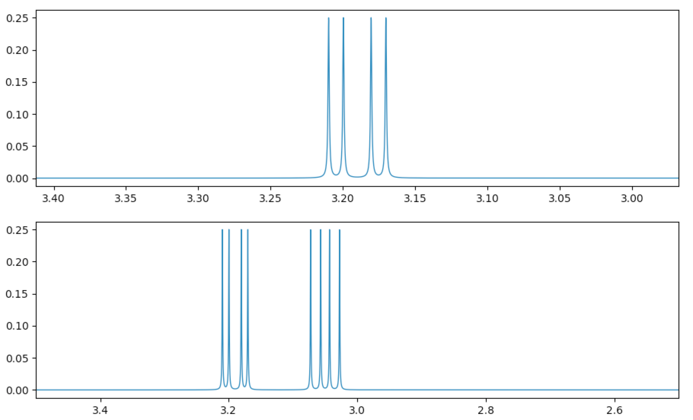

Note that the text between the two arrows in the subspectrum navigation panel now says "Subspectrum 2". Subspectra are numbered in the order they were created in. You can flip between subspectra by using the arrow buttons on either side of the "Subspectrum {n}" text.

Repeat the above steps for adding new subspectra and entering parameters. The third signal is entered as:

* **# of nuclei:** 1
* **JAX:** 7.7
* **#A:** 1
* **JBX:** 5.1
* **#B:** 1
* **Vcentr:** 3.93

the fourth as:

* **# of nuclei:** 2
* **JAX:** 8.5
* **Vcentr:** 6.89

(setting #B to 0 to create a doublet), and the fifth as:

* **# of nuclei:** 2
* **JAX:** 8.5
* **Vcentr:** 7.18

Expand the window by changing "v min" to -0.1 ppm and "v max" to 10 ppm. Your interface should look similar to this:

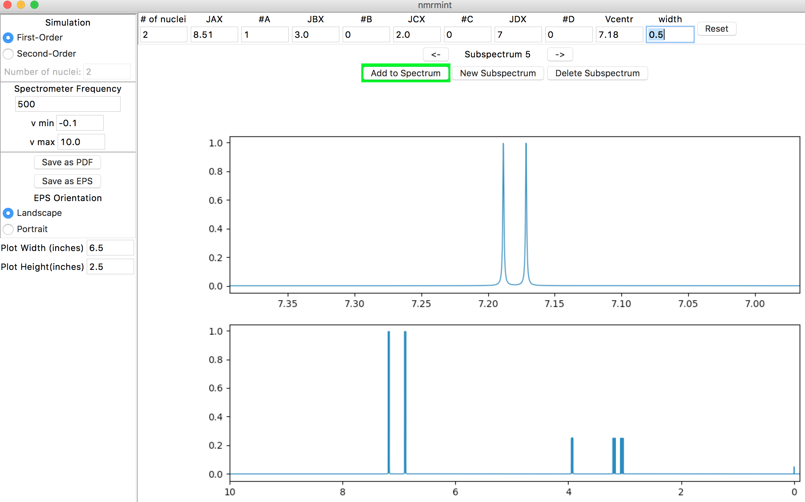

To finish the first-order spectrum, let's add the broad signals for the phenol and ammonium protons. For the phenol, a chemical shift of about 9.8 ppm would be appropriate. Create another subspectrum, and adjust the following settings:

* **# of nuclei:** 1
* **#A:** 0
* **#B:** 0
* **Vcentr:** 9.8
* **width:** 10 (Hz)

Add the subspectrum to the total subspectrum:

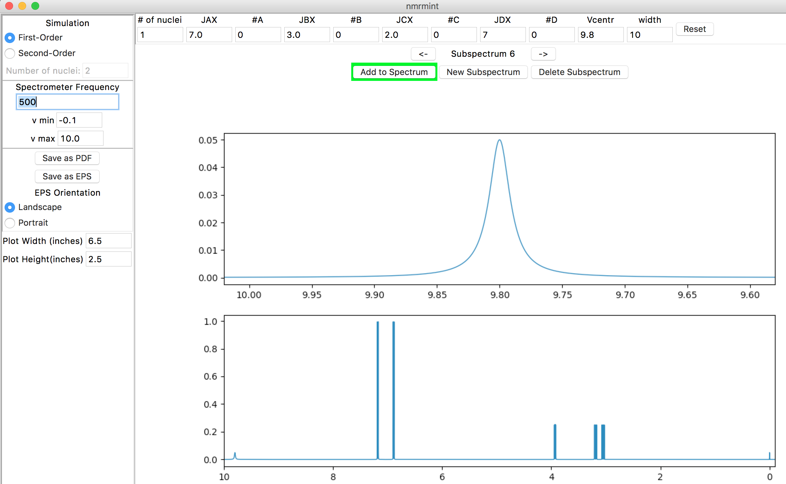

Repeat the process to add a 3H broad singlet at 8.3 ppm for the ammonium group:

* **# of nuclei:** 3
* **#A:** 0
* **#B:** 0
* **Vcentr:** 8.3
* **width:** 20 (Hz)

The final spectrum:

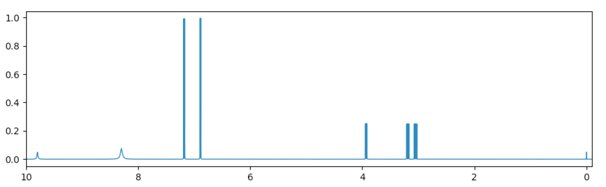

Again, at screen resolution much of the detail of this high-field spectrum will be lost. If we wanted to create a lower-field first-order spectrum suitable for an introductory course in NMR, we could reduce the spectrometer frequency and use that. Here is what the spectrum looks like at 60 MHz:

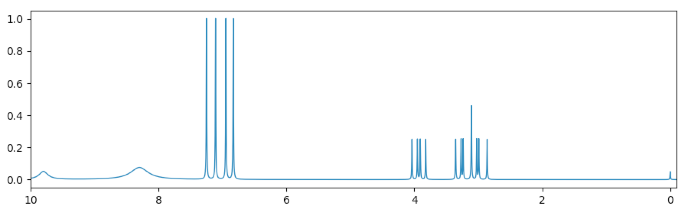

Alternatively, the 500 MHz spectrum can be used and saved as a PDF or EPS file, which have higher resolution, and then "v min" and "v max" can be used to create and save expansions as needed if the PDF/EPS print resolution is still too low. See the section on `Exporting as PDF or EPS`_.

Second-Order Simulation
-----------------------

At high-field, this first-order simulation matches the authentic spectrum fairly closely, but has an unnatural appearance because of the equal intensities for all the signals. At lower fields, the second-order behavior for the signals becomes more pronounced and the simulation will be increasingly less realistic. Let's revise the spectrum so that second-order calculations are used (but leaving the phenol OH proton as is).

We could flip back to Subspecta 1-5 and delete them using the "Delete Subspectrum" button, but maybe we haven't decided yet which simulation we prefer, and want to retain our previous work (currently, nmrmint does not have undo/redo options). Instead, use the arrow navigation buttons in the subspectrum navigation panel to flip to each multiplet, and click "Add to Spectrum" to remove it from the total spectrum (the button should toggle to a red background). This will leave only our broad singlet for the phenol, and TMS reference:

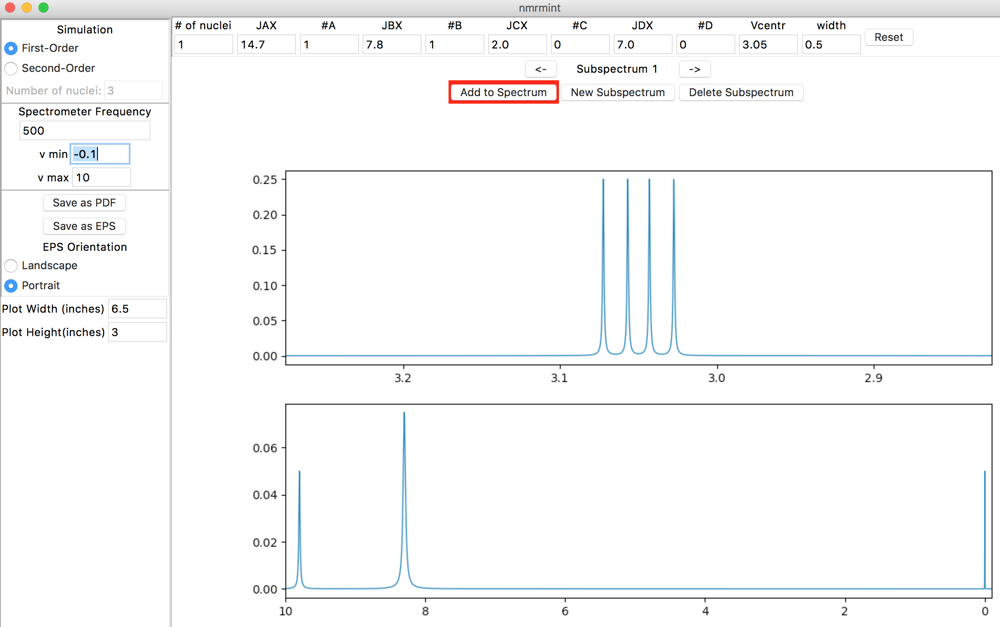

First, we will simulate the ABX system. Click the "New Subspectrum" button in the subspectra navigation panel to create a new subspectrum, then click the "Second-Order" radio button in the upper left "Simulation" panel. The "Number of nuclei" entry below the radio buttons will no longer be greyed out. Enter "3" for the number of nuclei and hit Return/Enter or Tab:

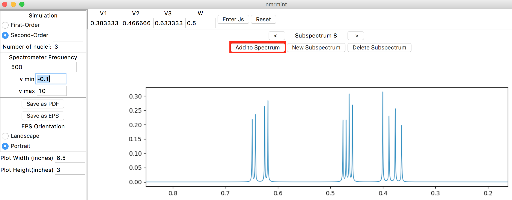

The top toolbar has "V1", "V2", and "V3" entries for the chemical shifts of the three protons. There is also a "W" entry for peak width, which we will leave at the default setting of 0.5 Hz. Enter the following chemical shifts:

* **V1:** 3.05
* **V2:** 3.19
* **V3:** 3.93

To enter the coupling constants, click the "Enter Js" button in the toolbar (to the right of the "W" entry). This will create a popup window for entering J values. Chemical shifts can also be entered in this pop-up window if desired. You can reposition the window if it's obscuring a part of the interface that you want to see:

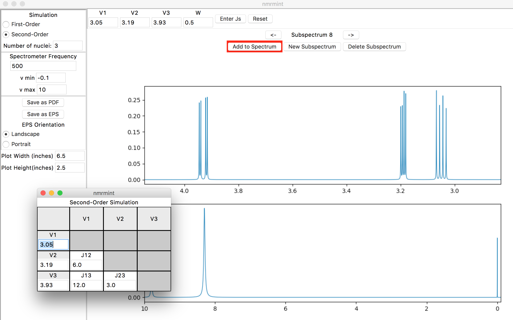

The placement of the J values in the table is important. "Jmn" corresponds to the coupling constant between the proton with chemical shift Vm and the proton with chemical shift Vn. In this case, for example, the coupling constant between V1 (3.05 ppm) and V2 (3.19 ppm), J12, is 14.7 Hz.

After entering the coupling constants in the pop-up window, and clicking the "Add to Spectrum" button, your specta should resemble this:

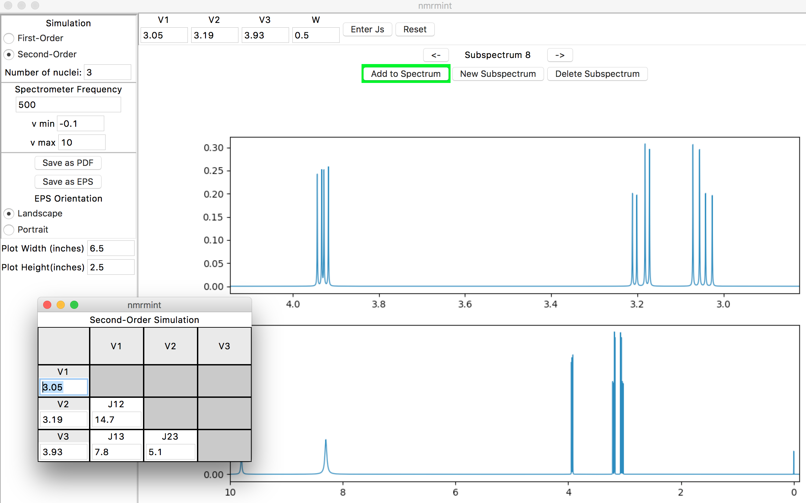

(If you lose the pop-up window behind the main application window, you can reposition windows or select them using your native operating system's standard commands. On Mac OSX, the "Window" menu at the top of your screen allows you to find and select the different windows in the app that's running.)

Next, let's enter the AA'XX' simulation for the para-substituted benzene ring. We will assume that the ortho- JAX (and JA'X') coupling is 8.5 Hz (the same coupling as reported in the original data). We don't know the other coupling constants exactly, but we can estimate meta- couplings (JAA' and JXX') of ~2 Hz, and para- couplings (JAX' and JA'X) of ~ 0 Hz.

Click on the "New Subspectrum" button, choose "Second-Order" in the Simulation panel, enter "4" for "Number of nuclei", and click "Enter Js" in the toolbar to get the popup window. Use the popup window to enter the following chemical shifts and frequencies:

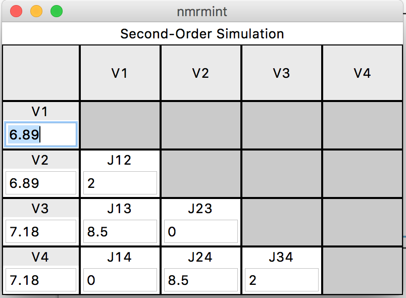

After closing the window and clicking the "Add to Spectrum" button, you should see the final simulated spectrum in the lower plot:

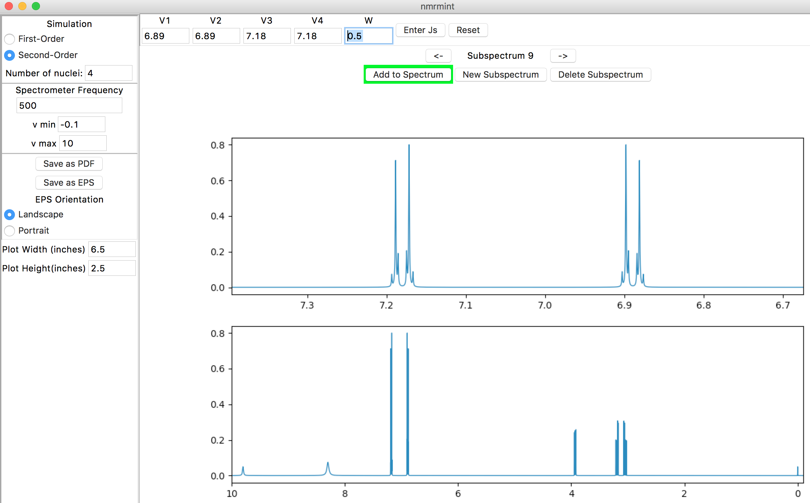

Lowering the spectrometer frequency to 80 MHz and zooming in on the 2.8-7.4 ppm region in the total spectrum amplifies the second-order behavior:

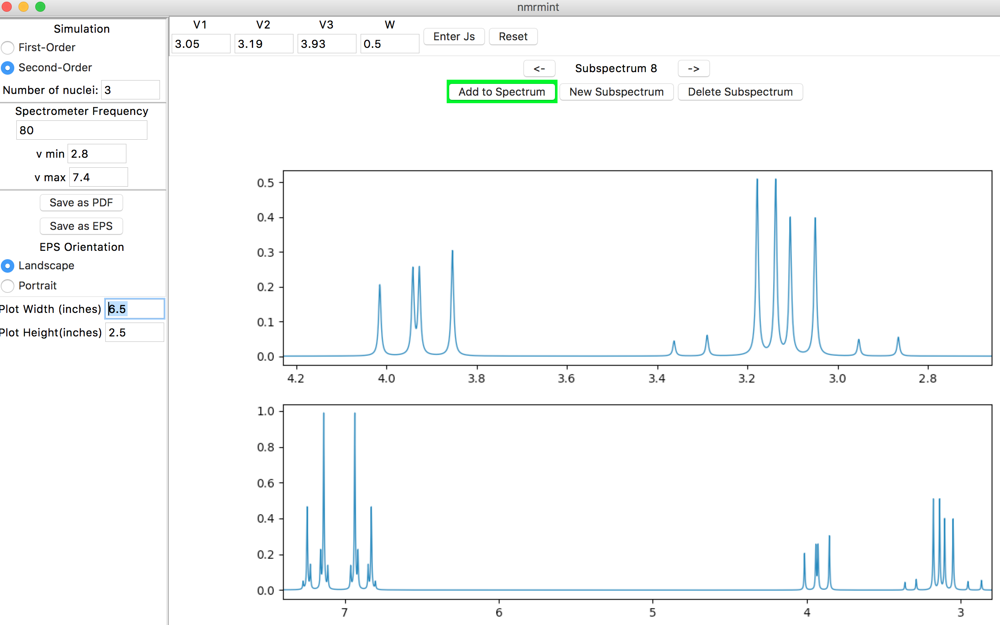

Exporting as PDF or EPS
-----------------------

Let's save the simulated total spectrum as a PDF first. We'll choose an intermediate field strength of 300 MHz and a window from -0.1 to 10.0 ppm. Assuming an 8.5" x 11" page with half-inch margins, enter the following dimensions in the left sidebar:

* **Plot Width(inches):** 10
* **Plot Height (inches):** 7.5

Then, click the "Save as PDF" button in the left sidebar. Save the file in a convenient location as "tyrosine_full". If you open up the PDF, it should have enough resolution to be able to see the splittings, but not easily. To demonstrate the "Save as EPS" feature, we'll create a series of expansions and save them as EPS files with portrait orientation (currently, PDF output is landscape orientation only).

Use "v min" = 2.9 and "v max" = 4.0 to expand the total plot to the region of the ABX system. Click the "Portrait" radio button in the left sidebar, and enter the following dimensions:

* **Plot Width(inches):** 3
* **Plot Height (inches):** 3

Then, click the "Save as EPS" button in the left sidebar. Save the file in the same location as before, as "ABX3x3". EPS files are good choices for importing into documents such as MS Word or ChemDraw files.

If you wish, you can also save an expansion for the AA'XX' system as well.

.. [#]  Currently, there is also a toolbar in the bottom-left corner of the interface, provided by the interface's graphing utility, matplotlib. If you are familiar with matplotlib, or just want to experiment with using it to perform functions such as zooming in/out or saving screenshots of the plots, you may, but this tutorial will not use this toolbar because of the quirks it introduces to the application behavior.
